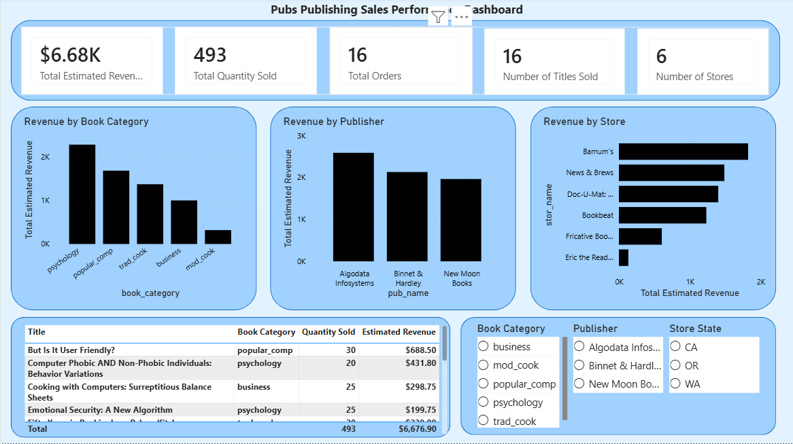

# Pubs Publishing Analytics Project

## Project Overview

This project analyzes a publishing company database using SQL, Python, Power BI, and GitHub.

The goal is to understand sales performance across books, publishers, stores, categories, and authors, then provide business recommendations to increase revenue.

## Dashboard Preview

## Tools Used

- SQL Server
- SQL Server Management Studio
- Python
- Power BI
- Git
- GitHub

## Key Insights

- Total estimated revenue was **$6,676.90**, with **493 total books sold**.
- **Psychology** was the top-performing book category by estimated revenue.
- **Algodata Infosystems** was the top publisher by estimated revenue.
- **Barnum's** was the top-performing store by estimated revenue.
- **California** was the strongest store state by estimated revenue.
- **Albert Ringer** was the top author connected to estimated revenue.

## Business Recommendations

- Continue investing in psychology titles because they drive the highest estimated revenue and quantity sold.
- Review opportunities to promote high-priced popular computer titles because they have strong revenue potential.
- Prioritize inventory and marketing support for high-performing stores such as Barnum's.
- Investigate lower-performing stores to understand whether performance is due to location, inventory, or demand.
- Give leadership regular visibility into publisher performance so they can focus partnerships on high-revenue publishers.

## Project Workflow

1. Created the SQL Server `pubs` database.
2. Explored database tables, row counts, columns, and relationships.
3. Wrote SQL queries for revenue, publisher, store, category, and author analysis.
4. Created a reusable SQL reporting view: `vw_sales_detail`.
5. Validated the reporting view against source data.
6. Used Python to extract the SQL view into a CSV file.
7. Used Python to validate and summarize the exported dataset.
8. Created Python revenue visualizations.
9. Built a Power BI dashboard.
10. Published the project to GitHub.